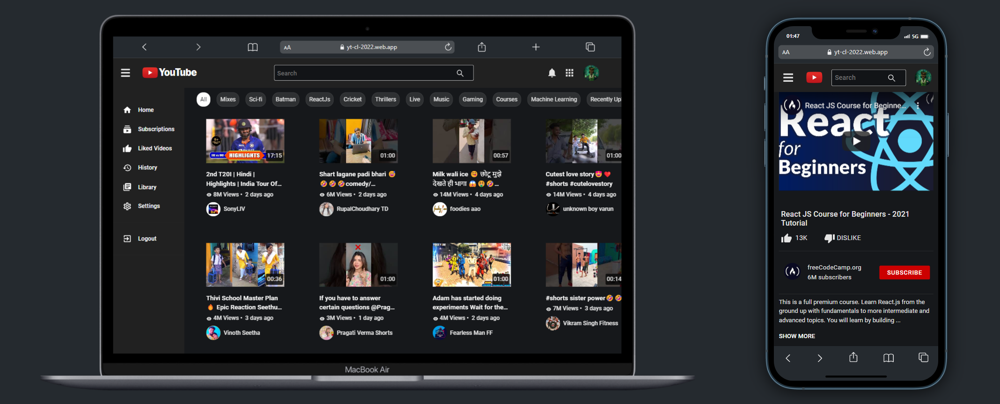

# YouTube Clone Using React-Redux and YouTube API

This Project is a Simple YouTube CLone Using React,Redux,Firebas and YouTube API.

Firebase Used For Login Authorization and YouTube API to Get the Data To Display.

Hosted App Link: <https://yt-cl-2022.web.app>

## Acknowledgements

- [YouTube API](https://developers.google.com/youtube/v3/docs)

## Authors

- [@SHUBHAMMORE](https://github.com/more1251)

## Deployment

Deployed using Firebase hosting

## Environment Variables

To run this project, you will need to add the following environment variables to your .env file

`API_KEY`

## Features

- Get Popular Videos on HomeScreen
- Get your Liked Videos from YouTube Server
- Mobile Responsive
- Search videos you want to watch
- Get your Subscribed channel list in Subscription Window
- Get videos by categories

## Tech Stack

**Client:** React, Redux, Sass, Bootstrap

**NPM Packages:** moment, numeral, Helmet, react-custom-scrollbars, loading-skeleton, indiana-drag-scroll, infinite-scroll-component, lazy-load-image-component, router-dom,show-more-text
